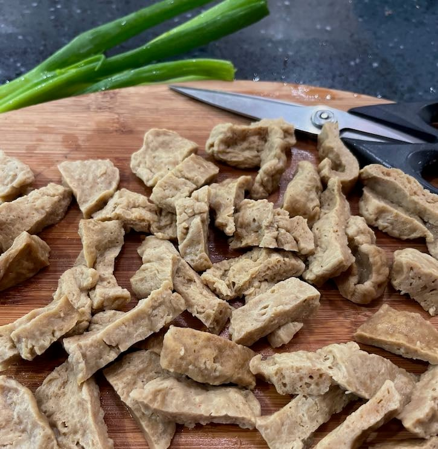

# This is the Readme File
### What to find in this directory?
You will find recipes that Lianne likes.
These recipes are all <b>VEGAN!</b>! Wowzer!
### Recipes
<ol>
  <li>Seitan</li>
  <li>Vegan Banana Bread</li>
</ol>

#### Seitan

<ul>
    <li> Plant-based meat substitute made from wheat gluten that mimics the flavor and texture of chicken</i>
    <li><i>URL: https://theveganatlas.com/homemade-seitan-recipe/</i></li>
</ul>
